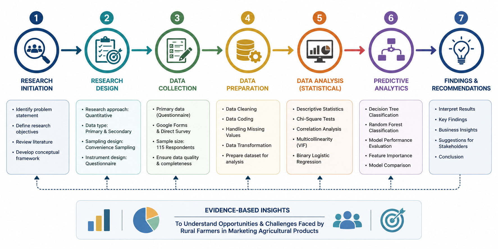
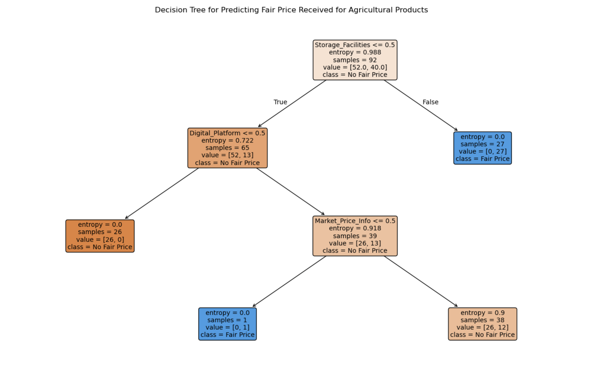
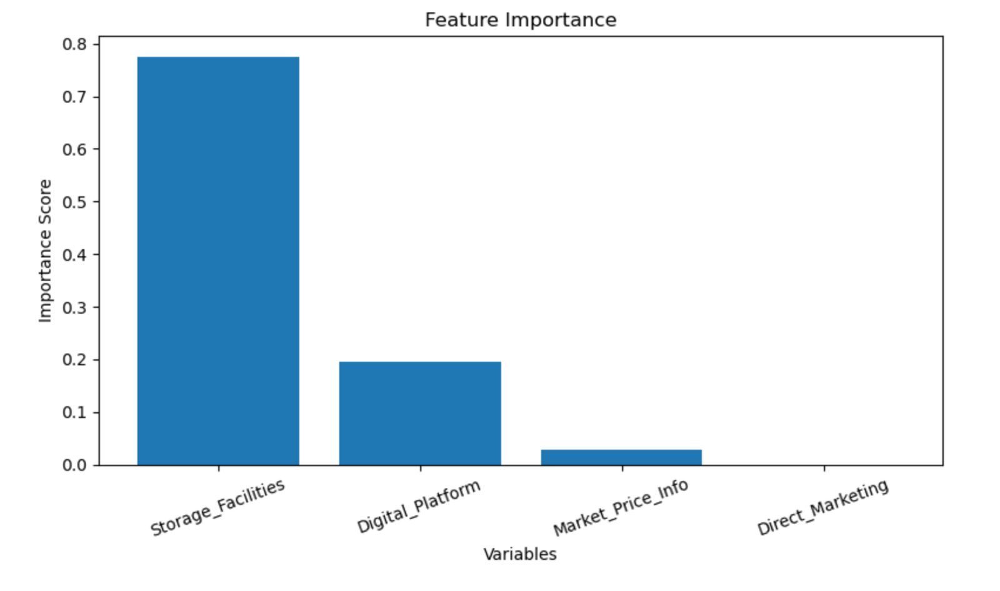
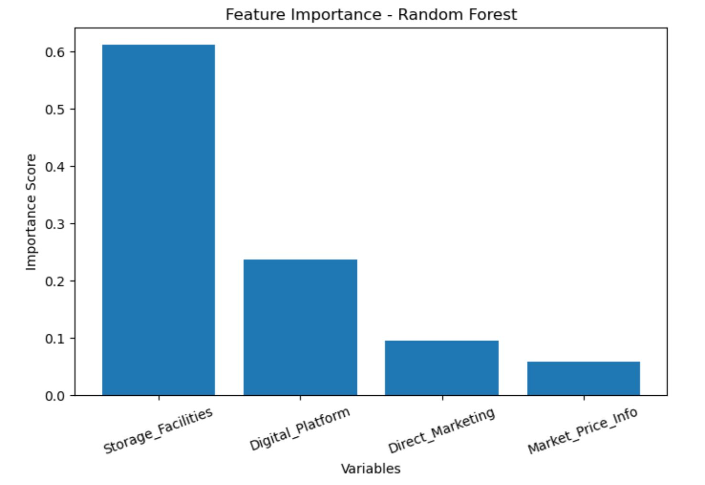
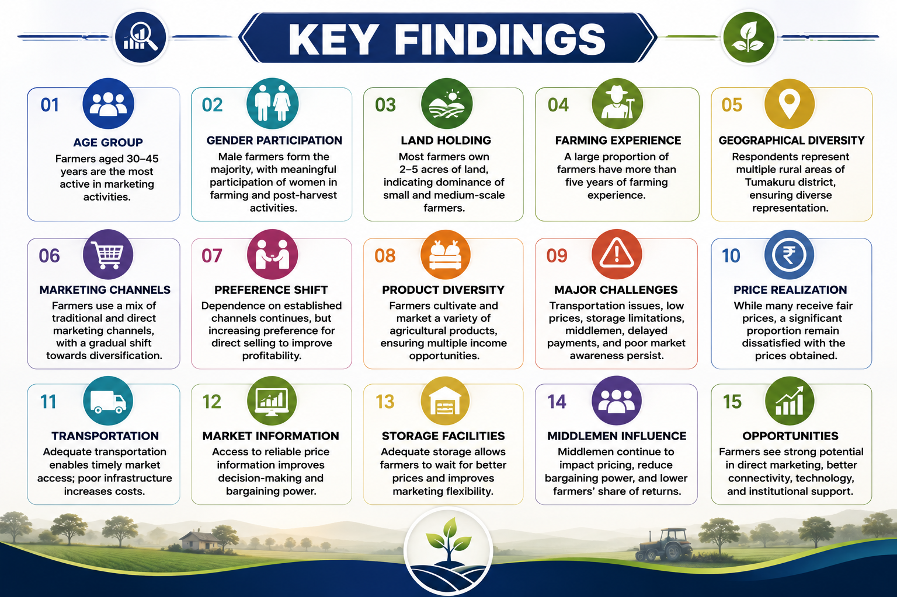
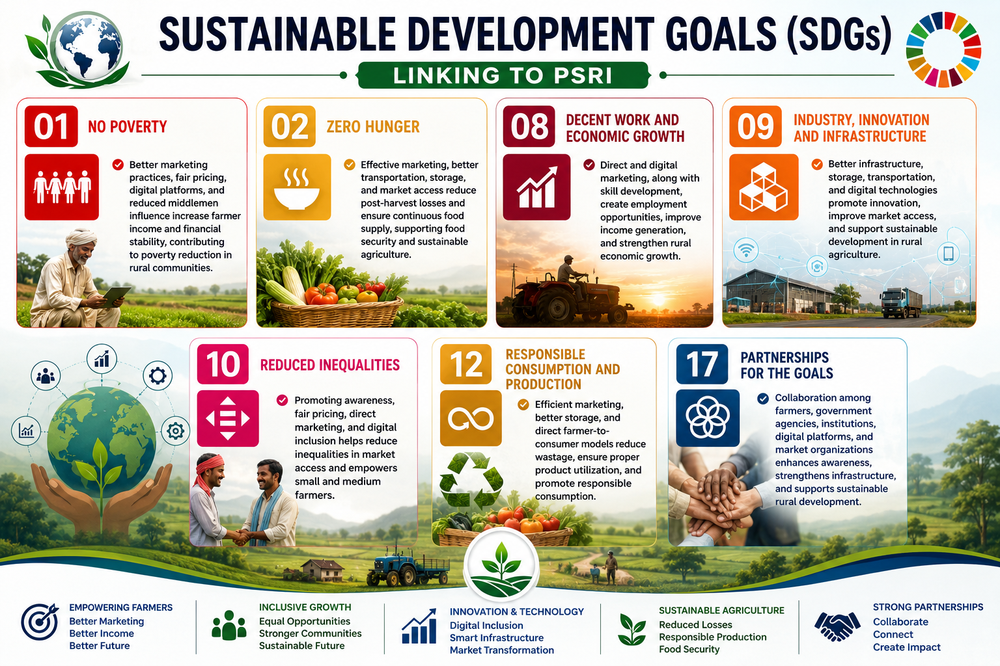

# 🌾 Opportunities and Challenges Faced by Rural Farmers in Marketing Agricultural Products

### An MBA Dissertation in Business Analytics, Rural Development & Predictive Modelling

*Submitted in partial fulfilment for the award of the degree of Master of Business Administration (N2MBAPS)*
*Department of MBA, Siddaganga Institute of Technology, Tumakuru — Karnataka, India*
*By **Raghavendra S** (1SI25BA069) · Under the guidance of **Dr. Anitha B R***

---

## 📖 Project Overview

> Agricultural marketing plays a vital role in enhancing farmers' income, livelihood, and overall economic well-being. Yet rural farmers continue to face challenges — dependence on middlemen, weak transportation and storage infrastructure, poor access to market information, and low awareness of digital and direct marketing practices.

This repository hosts a complete MBA dissertation that investigates the **opportunities and challenges faced by rural farmers in marketing agricultural products**, with a special focus on selected rural areas of **Tumakuru district, Karnataka**.

The research combines classical **descriptive and inferential statistics** with modern **machine learning classification models** to move beyond description and build an evidence-based, predictive understanding of **fair price realization** among rural farmers — the study's central outcome variable.

Primary data were collected from **115 rural farmers** and analyzed using **Microsoft Excel** and **Python (Jupyter Notebook)**, applying Chi-Square Tests, Pearson Correlation, Variance Inflation Factor (VIF), Binary Logistic Regression, Decision Tree Classification, and Random Forest Classification.

---

## 📑 Table of Contents

- [Problem Statement](#-problem-statement)
- [Research Objectives](#-research-objectives)
- [Research Methodology](#-research-methodology)
- [Technology Stack](#-technology-stack)
- [Research Workflow](#-research-workflow)
- [Dataset Overview](#-dataset-overview)
- [Data Analysis and Interpretation](#-data-analysis-and-interpretation)
- [Statistical Analysis](#-statistical-analysis)
- [Machine Learning Section](#-machine-learning-section)
  - [Decision Tree Classification](#-decision-tree-classification)
  - [Random Forest Classification](#-random-forest-classification)
  - [Model Comparison](#model-comparison)
- [Key Findings](#-key-findings)
- [Business Recommendations](#-business-recommendations)
- [Sustainable Development Goals](#-sustainable-development-goals-sdgs)
- [Repository Structure](#-repository-structure)
- [Project Assets](#-project-assets)
- [Future Scope](#-future-scope)
- [About the Author](#-about-the-author)
- [Acknowledgements](#-acknowledgements)

---

## 🧩 Problem Statement

Agricultural marketing plays a vital role in improving the income and livelihood of rural farmers by enabling them to sell their agricultural products at fair prices and access wider markets. However, many rural farmers still depend on **traditional marketing channels and intermediaries**. The dominance of middlemen, price fluctuations, inadequate transportation and storage facilities, and limited access to timely market information often result in lower returns for farmers.

Although direct marketing methods, digital platforms, online marketplaces, and digital payment systems have created new opportunities, their adoption among rural farmers remains limited due to low digital literacy, inadequate awareness, and restricted access to technology.

> This study was undertaken to examine these opportunities and challenges, and — critically — to **identify the key factors that influence whether rural farmers receive fair prices** for their agricultural products, supporting better decision-making, policy formulation, and marketing strategy design.

---

## 🎯 Research Objectives

- To understand the existing marketing methods used by rural farmers for selling agricultural produce.
- To analyze the marketing opportunities available for rural farmers in agricultural marketing practices.
- To analyze the role of digital marketing in promoting agricultural products.
- To identify the challenges faced by rural farmers in marketing agricultural products.
- To develop and evaluate a predictive model for identifying the key factors influencing whether rural farmers receive a fair price for their agricultural products.

---

## 🔬 Research Methodology

<table>
<tr><td><strong>Research Design</strong></td><td>Descriptive Research Design</td></tr>
<tr><td><strong>Research Approach</strong></td><td>Quantitative Research Approach</td></tr>
<tr><td><strong>Sampling Technique</strong></td><td>Convenience Sampling (non-probability)</td></tr>
<tr><td><strong>Sample Size</strong></td><td>115 rural farmers</td></tr>
<tr><td><strong>Study Area</strong></td><td>Selected rural areas of Tumakuru district, Karnataka — Gubbi, Koratagere, Kunigal, Madhugiri, Pavagada, Sira, Tiptur, Tumkur Rural, Turuvekere</td></tr>
<tr><td><strong>Primary Data</strong></td><td>Structured questionnaire (prepared in English and Kannada), administered via direct survey; 115 valid responses collected</td></tr>
<tr><td><strong>Secondary Data</strong></td><td>Books, peer-reviewed research journals, government publications, reports from the Ministry of Agriculture and Farmers Welfare, NABARD, FAO, official websites, and academic publications</td></tr>
<tr><td><strong>Tools Used</strong></td><td>Microsoft Excel (data organization & preprocessing) and Python / Jupyter Notebook (statistical & predictive analysis)</td></tr>
</table>

<strong>📌 Limitations of the Study</strong>

- Geographically limited to selected rural areas of Tumakuru; findings may not fully represent other regions.
- Based on a limited number of respondents, which may affect generalizability.
- Some responses were opinion-based rather than strictly practical/factual.
- Conducted within a specific time period; seasonal and future market variations may not be captured.
- The predictive model is based on the collected sample and questionnaire variables, and may require validation on larger datasets before wider generalization.

---

## 🛠 Technology Stack

| Layer | Tools |
|---|---|
| Data Entry & Cleaning | Microsoft Excel |
| Data Management | Pandas, NumPy |
| Statistical Testing | SciPy, Statsmodels |
| Predictive Modelling | Scikit-learn (Decision Tree, Random Forest) |
| Visualization | Matplotlib |
| Documentation & Versioning | GitHub |

---

## 🔄 Research Workflow

The research followed a structured, end-to-end analytical pipeline:

1. **Problem Identification** – Defining the opportunities and challenges faced by rural farmers in agricultural marketing.
2. **Literature Review** – Reviewing prior research on agricultural marketing, digital agriculture, and direct-to-consumer models to identify research gaps.
3. **Questionnaire Design** – Structured questionnaire prepared in English and Kannada covering demographics, marketing practices, and perceptions.
4. **Data Collection** – 115 valid responses gathered from rural farmers via direct survey across Tumakuru district.
5. **Data Cleaning & Coding** – Responses compiled, verified, and numerically coded in Microsoft Excel.
6. **Descriptive Analysis** – Frequency and percentage analysis of demographic and marketing-practice variables.
7. **Inferential Statistics** – Chi-Square Tests, Pearson Correlation, and VIF assessment to examine relationships and multicollinearity.
8. **Predictive Modelling** – Binary Logistic Regression, Decision Tree, and Random Forest Classification to identify key drivers of fair price realization.
9. **Findings, Suggestions & Conclusion** – Synthesizing results into actionable business and policy recommendations.

---

## 🗂 Dataset Overview

| Attribute | Detail |
|---|---|
| **Respondents** | 115 rural farmers |
| **Dependent Variable** | Fair Price Realization (Yes = 1, No = 0) |
| **Independent Variables** | Awareness of Direct Marketing Methods, Use of Digital Platforms for Selling, Market Price Information, Storage Facilities Availability, Middlemen Influence on Pricing, Customer Interest in Purchasing Directly from Farmers, Preference for Using Digital Platforms |
| **Coding Scheme** | Dichotomous (Yes/No) variables coded as Yes = 1, No = 0; demographic variables (Gender, Age Group, Education, Land Holding, Farming Experience) coded categorically per Table 3.1 |

<strong>📋 View Full Variable Coding Table</strong>

| Variable | Type | Coding |
|---|---|---|
| Awareness of Direct Marketing Methods | Independent | Yes = 1, No = 0 |
| Use of Digital Platforms for Selling | Independent | Yes = 1, No = 0 |
| Market Price Information | Independent | Yes = 1, No = 0 |
| Storage Facilities Availability | Independent | Yes = 1, No = 0 |
| Middlemen Influence on Pricing | Independent | Yes = 1, No = 0 |
| Customer Interest in Purchasing Directly from Farmers | Independent | Yes = 1, No = 0 |
| Preference for Using Digital Platforms | Independent | Yes = 1, No = 0 |
| **Fair Price Realization** | **Dependent (Target)** | Yes = 1, No = 0 |

---

## 📊 Data Analysis and Interpretation

Before advancing to inferential and predictive techniques, the study conducted a thorough **descriptive analysis** of all 115 respondents using frequency distribution, percentage analysis, tables, and graphs. This phase profiled respondents' age, gender, landholding size, farming experience, and area, alongside their marketing practices, perceived challenges, opportunities, and adoption of digital tools.

Key descriptive observations include:
- Agricultural marketing activity was concentrated among farmers in the **30–45 years** age group.
- **Male farmers** formed the majority of respondents, though women's participation in post-harvest activities was notable.
- Most respondents held **2–5 acres** of land, indicating a small-and-medium farmer profile.
- **61.7%** of respondents had more than 5 years of farming experience.
- Respondents spanned nine areas of Tumakuru district — Gubbi, Koratagere, Kunigal, Madhugiri, Pavagada, Sira, Tiptur, Tumkur Rural, and Turuvekere.
- **73.9%** of respondents reported inadequate storage facilities for preserving agricultural produce.
- Low price (46.1%) and middlemen control (27.8%) emerged as the most frequently cited marketing problems (multiple response).

This descriptive foundation informed the selection of variables carried forward into the statistical and machine learning stages.

---

## 📈 Statistical Analysis

### Chi-Square Tests of Association

Five hypotheses were tested at a 5% significance level (α = 0.05) using Python (Jupyter Notebook):

| Hypothesis | Relationship Tested | χ² | p-value | Decision |
|---|---|---|---|---|
| H1 | Direct Marketing Awareness ↔ Digital Platform Usage | 96.531 | < 0.001 | Reject H₀ |
| H2 | Digital Platform Usage ↔ Perception that Digital Platforms Help Promotion | 110.248 | < 0.001 | Reject H₀ |
| H3 | Market Price Information ↔ Fair Price Received | 22.271 | < 0.001 | Reject H₀ |
| H4 | Middlemen Influence on Pricing ↔ Fair Price Received | 110.806 | < 0.001 | Reject H₀ |
| H5 | Customer Interest in Direct Purchase ↔ Preference for Digital Platforms | 105.564 | < 0.001 | Reject H₀ |

**Contribution:** All five null hypotheses were rejected, confirming statistically significant associations across every tested relationship — demonstrating that awareness, digital adoption, market information access, and middlemen influence are all meaningfully connected to farmers' marketing behaviour and pricing outcomes.

### Correlation Analysis

A Pearson Correlation Matrix was computed across Direct Marketing Awareness, Digital Platform Usage, Market Price Information, Fair Price Received, and Storage Facilities.

- **Direct Marketing Awareness ↔ Market Price Information:** r = 0.958 (very strong positive)
- **Direct Marketing Awareness ↔ Digital Platform Usage:** r = 0.938 (very strong positive)
- **Digital Platform Usage ↔ Market Price Information:** r = 0.895 (strong positive)
- **Fair Price Received ↔ Storage Facilities:** r = 0.755 (moderate-to-strong positive)

**Contribution:** All relationships were positive, reinforcing that improvements in awareness, digital adoption, and infrastructure move together — and that storage facilities are meaningfully tied to fair price outcomes.

### Variance Inflation Factor (VIF)

| Variable | VIF | Interpretation |
|---|---|---|
| Direct Marketing | 20.06 | Severe Multicollinearity |
| Digital Platform | 8.47 | High Multicollinearity |
| Market Price Information | 12.25 | Severe Multicollinearity |
| Storage Facilities | 1.19 | No Multicollinearity |

**Contribution:** Because Direct Marketing, Digital Platform, and Market Price Information were highly intercorrelated, the Binary Logistic Regression model was built using only **Market Price Information** as the predictor, to preserve statistical stability.

### Binary Logistic Regression

| Model Statistic | Value |
|---|---|
| Dependent Variable | Fair Price Received |
| Independent Variable | Market Price Information |
| Log-Likelihood | −61.222 |
| Pseudo R² | 0.1998 |
| LLR p-value | 3.201 × 10⁻⁸ |
| Coefficient (β) | 3.563 |
| p-value | 0.001 |
| 95% CI | 1.526 to 5.600 |

**Contribution:** The model converged successfully and was statistically significant. Market Price Information showed a strong, statistically significant positive effect on the likelihood of receiving a fair price — approximately 20% of the variation in fair price realization is explained by this single predictor.

---

## 🤖 Machine Learning Section

Beyond traditional inferential statistics, the study developed two supervised classification models — **Decision Tree** and **Random Forest** — to predict whether a rural farmer receives a fair price for agricultural produce, using **Direct Marketing Awareness, Digital Platform Usage, Market Price Information, and Storage Facilities** as predictors.

### 🌳 Decision Tree Classification

**Why Decision Tree?** As a supervised learning algorithm, Decision Tree classifies observations by recursively splitting the dataset into homogeneous groups based on predictor variables — offering an intuitive, rule-based structure that is easy to interpret for both academic and business audiences.

**Model Performance**

| Metric | Value |
|---|---|
| Training Accuracy | 87.0% |
| Testing Accuracy | 91.3% |
| Overall Accuracy | 91.3% |

**Confusion Matrix** (23 testing observations)

| | Predicted: No Fair Price | Predicted: Fair Price | Total |
|---|---|---|---|
| **Actual: No Fair Price** | 18 | 1 | 19 |
| **Actual: Fair Price** | 1 | 3 | 4 |

**Classification Report**

| Class | Precision | Recall | F1-Score |
|---|---|---|---|
| No Fair Price | 0.95 | 0.95 | 0.95 |
| Fair Price | 0.75 | 0.75 | 0.75 |

**Interpretation:** Only two misclassifications occurred out of 23 test cases (1 false positive, 1 false negative), reflecting strong, reliable performance.

**Feature Importance (Decision Tree)**

| Variable | Importance Score | Rank |
|---|---|---|
| Storage Facilities | 0.775 | 1 |
| Digital Platform Usage | 0.196 | 2 |
| Market Price Information | 0.029 | 3 |
| Direct Marketing Awareness | 0.000 | 4 |

**Key Finding:** **Storage Facilities** emerged as the most influential predictor — farmers with adequate storage were directly classified as receiving a fair price. **Digital Platform Usage** was the next most important predictor, followed by **Market Price Information**. Notably, **Direct Marketing Awareness received zero importance** in this single Decision Tree — not because it is unimportant in reality, but simply because the tree never selected it for a split, likely due to its strong correlation with the other predictors already used higher up in the tree.

---

### 🌲 Random Forest Classification

**Why Random Forest, and why after Decision Tree?** A single Decision Tree can be sensitive to the specific splits it happens to choose — as seen above, it assigned zero importance to Direct Marketing Awareness purely as an artifact of its structure. Random Forest was developed next to validate and strengthen these findings.

Random Forest is an **ensemble** method: it builds many individual decision trees on different random subsets of the data and features, then combines their predictions. This approach:

- **Improves robustness** — the model's conclusions are averaged across many trees rather than depending on one tree's specific splits.
- **Reduces overfitting** — averaging across trees smooths out noise that a single tree might otherwise memorize.
- **Produces more reliable variable importance** — because importance is aggregated across many trees, a variable that is useful even in a supporting role (not just at the very first split) gets properly credited.

**Model Performance**

| Metric | Value |
|---|---|
| Training Accuracy | 86.96% |
| Testing Accuracy | 91.30% |
| Overall Accuracy | 91.30% |

**Confusion Matrix** (23 testing observations)

| | Predicted: No Fair Price | Predicted: Fair Price | Total |
|---|---|---|---|
| **Actual: No Fair Price** | 18 | 1 | 19 |
| **Actual: Fair Price** | 1 | 3 | 4 |

**Classification Report**

| Class | Precision | Recall | F1-Score |
|---|---|---|---|
| No Fair Price | 0.95 | 0.95 | 0.95 |
| Fair Price | 0.75 | 0.75 | 0.75 |

*(Macro average: 0.85 · Weighted average: 0.91)*

**Feature Importance (Random Forest)**

| Variable | Importance Score | Rank |
|---|---|---|
| Storage Facilities | 0.6109 | 1 |
| Digital Platform Usage | 0.2367 | 2 |
| Direct Marketing Awareness | 0.0941 | 3 |
| Market Price Information | 0.0583 | 4 |

**🔑 Major Research Contribution:** Although **Direct Marketing Awareness did not appear as an important split in the single Decision Tree** (importance = 0.000), the **Random Forest recognised its contribution across multiple trees**, assigning it a meaningful importance score of **0.0941**. Because Random Forest evaluates many different tree structures rather than relying on one dominant path, it captured the predictive value of *all* relevant variables far more effectively than the single Decision Tree could — a clear demonstration of why ensemble methods provide a more complete picture of variable importance.

---

### Model Comparison

| Performance Measure | Decision Tree | Random Forest |
|---|---|---|
| Training Accuracy | 87.00% | 86.96% |
| Testing Accuracy | 91.30% | 91.30% |
| Overall Accuracy | 91.30% | 91.30% |
| Precision (No Fair Price) | 0.95 | 0.95 |
| Recall (No Fair Price) | 0.95 | 0.95 |
| F1-Score (No Fair Price) | 0.95 | 0.95 |
| Precision (Fair Price) | 0.75 | 0.75 |
| Recall (Fair Price) | 0.75 | 0.75 |
| F1-Score (Fair Price) | 0.75 | 0.75 |

| Dimension | Decision Tree | Random Forest |
|---|---|---|
| **Interpretability** | High — simple, visual rule-based structure | Moderate — aggregated across many trees, less directly visualizable |
| **Robustness** | Lower — sensitive to a single tree's splits | Higher — predictions averaged across an ensemble |
| **Feature Importance** | Assigned zero importance to one variable | Assigned meaningful importance to *every* predictor |
| **Generalization** | Good (91.3% testing accuracy) | Equally good (91.30% testing accuracy), with more stable estimates |
| **Business Usefulness** | Easy to explain to non-technical stakeholders | More trustworthy for identifying *all* drivers of fair pricing |

**Conclusion:** Both models achieved **identical** testing and overall accuracy (91.30%) and identical Precision/Recall/F1 scores. However, because Random Forest reduces overfitting risk and produced meaningful importance scores for all four predictors — rather than zeroing one out — it is considered the **more reliable and preferred model** for understanding fair price realization among rural farmers.

---

## 🔑 Key Findings

- **Descriptive findings:** Marketing activity is concentrated among 30–45-year-old, small-to-medium landholding farmers with over 5 years of experience; transportation, storage, market information gaps, and middlemen influence remain persistent, interconnected challenges.
- **Chi-Square findings:** All five hypotheses confirmed statistically significant associations (all p < 0.001) — linking direct marketing awareness, digital platform adoption, market information, middlemen influence, and customer interest in direct purchasing.
- **Correlation findings:** Strong positive relationships exist among direct marketing awareness, digital platform usage, and market price information; storage facilities are positively associated with fair price realization.
- **Binary Logistic Regression findings:** Market Price Information is a statistically significant predictor of fair price realization (β = 3.563, p = 0.001), with the overall model statistically significant (LLR p = 3.201 × 10⁻⁸).
- **Decision Tree findings:** Achieved 91.3% testing accuracy; Storage Facilities was the most influential predictor, followed by Digital Platform Usage and Market Price Information.
- **Random Forest findings:** Also achieved 91.30% testing accuracy; Storage Facilities ranked first, followed by Digital Platform Usage, Direct Marketing Awareness, and Market Price Information — capturing the contribution of all predictors more completely.
- **Overall business insight:** Fair price realization is driven by the **combined interaction** of storage infrastructure, digital platform adoption, market information access, and direct marketing awareness — not by any single factor. The Random Forest model is considered the more robust and reliable of the two predictive models due to its ensemble-based stability and comprehensive feature importance estimates.

---

## 💡 Business Recommendations

1. **Strengthen Market Information Systems** — Expand real-time price information through mobile apps, digital boards, and extension services to reduce information asymmetry.
2. **Improve Storage and Post-Harvest Infrastructure** — Invest in scientific storage, warehousing, cold storage, and village-level post-harvest management, since storage emerged as the single most influential factor in fair price realization.
3. **Promote Digital Agricultural Marketing** — Encourage adoption of digital marketplaces, mobile apps, and social media channels for wider market visibility.
4. **Expand Farmer Awareness and Capacity-Building Programmes** — Organize regular training on direct marketing, digital tools, pricing strategy, financial literacy, and negotiation skills.
5. **Encourage Direct Farmer-to-Consumer Marketing Models** — Promote farmers' markets, community-supported agriculture, and organized farm-gate sales to reduce intermediary dependence.
6. **Improve Rural Marketing Infrastructure and Logistics** — Strengthen road connectivity, transportation, grading and collection centres to reduce marketing costs and losses.
7. **Strengthen Institutional and Policy Support** — Coordinate extension services, financial assistance, and digital inclusion programmes across government and farmer organizations.
8. **Promote Data-Driven Agricultural Decision-Making** — Encourage wider use of analytics and predictive modelling by agricultural institutions and policymakers.
9. **Foster Integrated Agricultural Marketing Systems** — Unify market information, digital technology, storage, transportation, and institutional support into a single coordinated marketing ecosystem rather than isolated interventions.

---

## 🌍 Sustainable Development Goals (SDGs)

| SDG | Contribution of This Study |
|---|---|
| **SDG 1 – No Poverty** | Improves the economic condition of rural farmers through better marketing practices, fair pricing, digital platforms, and reduced middlemen influence. |
| **SDG 2 – Zero Hunger** | Highlights transportation, storage, and market access improvements that reduce post-harvest losses and support continuous agricultural productivity. |
| **SDG 8 – Decent Work and Economic Growth** | Encourages direct and digital marketing as sources of income generation, entrepreneurship, and rural economic activity. |
| **SDG 9 – Industry, Innovation and Infrastructure** | Highlights the need for better transportation, storage, and digital infrastructure, along with growing adoption of digital payment systems. |
| **SDG 10 – Reduced Inequalities** | Supports awareness programs, direct marketing opportunities, and digital inclusion to help small and medium farmers compete more effectively. |
| **SDG 12 – Responsible Consumption and Production** | Promotes efficient marketing practices, better storage, and direct selling that reduce wastage and encourage responsible produce distribution. |
| **SDG 17 – Partnerships for the Goals** | Emphasizes cooperation between farmers, government agencies, digital platforms, and agricultural institutions to strengthen rural marketing systems. |

---

## 📁 Repository Structure
├── data/            # Survey dataset used for statistical and predictive analysis
├── notebook/         # Jupyter Notebook with Python-based statistical & ML analysis
├── report/           # Final dissertation report (PDF)
├── presentation/     # Project presentation slides
├── docs/             # Supporting documentation
├── images/           # Charts, diagrams, and visual assets used in this README
└── README.md

---

## 📦 Project Assets

| Asset | Description |
|---|---|
| 📊 **Dataset** | Coded primary survey data from 115 rural farmers (`data/`) |
| 📓 **Notebook** | Complete Python analysis — Chi-Square, Correlation, VIF, Logistic Regression, Decision Tree, Random Forest (`notebook/`) |
| 🖥 **Presentation** | Summary slide deck of the research (`presentation/`) |
| 📄 **Final Report** | Complete MBA dissertation report in PDF (`report/`) |
| 📚 **Supporting Documents** | Reference materials and questionnaire (`docs/`) |
| 🖼 **Images** | All charts, diagrams, and figures referenced in this README (`images/`) |

---

## 🔮 Future Scope

- **Larger datasets** — Expanding the sample size beyond 115 respondents to improve statistical power and model generalizability.
- **More regions** — Extending the study beyond Tumakuru district to other rural and agricultural regions of Karnataka and India for comparative analysis.
- **Additional machine learning models** — Exploring Gradient Boosting, XGBoost, or Neural Networks to further improve predictive accuracy and robustness.
- **Real-time agricultural analytics** — Integrating live market price feeds, IoT-based storage monitoring, and real-time digital platform usage data to build dynamic, continuously updated predictive models for fair price realization.

---

## 👤 About the Author

**Raghavendra S**
MBA (Marketing) · PGP in Data Science & Engineering
AI, Business Analytics & Marketing Professional

---

## 🙏 Acknowledgements

Sincere gratitude to **Siddaganga Institute of Technology, Tumakuru**, and the **Department of MBA**, for providing the platform to undertake this research. Special thanks to **Dr. Anitha B R**, Assistant Professor and project guide, for her invaluable guidance and support throughout the study, and to **Dr. M Ajoy Kumar**, Head of the Department of MBA, for his encouragement and support. Heartfelt thanks to the **115 rural farmers** of Tumakuru district who generously gave their time to participate in this survey, and to the entire faculty whose inspiration made this project possible.

---

*If you found this research useful, consider ⭐ starring the repository.*

